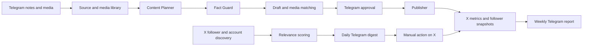

# FlexDropin X Growth Bot — follower growth and Telegram control design

Date: 2026-08-10
Status: approved in conversation; awaiting review of this written specification

## 1. Context

The current bot publishes frequently, but the account is not converting that activity into meaningful reach or relevant followers. An audit of all 83 original posts published by `@FlexDropin` between 2026-07-17 and 2026-08-09 found:

- 83 posts across 24 active days, or 3.46 posts per active day;
- 655 total impressions, 7.89 mean impressions and 5 median impressions per post;
- 20 posts about bugs or debugging (24.1%); in the latest seven-day window, 6 of 22 posts (27.3%);
- 20 bug-related posts averaged 6.4 impressions, versus 8.37 for other posts;
- 28 posts containing first-person story markers that were not backed by founder-provided facts;
- 16 posts containing numerical or business claims without recorded provenance;
- multiple high-risk claims about double charges, phantom bookings, outages, incorrect fees and customer-impacting defects;
- a public claim that the platform fee was 8%, while the current partner website says 15%; and
- two practical fitness posts that generated 94 and 80 impressions, far above the account median.

The current code explains these outcomes. Bug stories are reinforced by the character examples, founder-agent instructions and human-mode prompt. Posts are scored in isolation, with no portfolio-level content balance or factual provenance. A low-scoring candidate is eventually published anyway. The engagement flow acts only on curated `.env` targets, while the separate growth flow automatically follows accounts but does not feed them into a useful decision process. New followers are read only for unfollow decisions.

The account currently has 5 followers and follows 63 accounts. The immediate business objective is therefore relevant follower growth, not conversation volume or generic engagement.

## 2. Goals

The redesign must:

1. Grow the number of relevant followers of `@FlexDropin`.
2. Publish fewer, materially better posts that make the right audience want to follow the account.
3. Prevent invented founder stories, product incidents, numbers, customer outcomes and medical claims.
4. Use Telegram as the primary control surface for content, media, growth opportunities, approvals, status and errors.
5. Discover and rank relevant accounts automatically while leaving the final action on X to Floriano.
6. Keep uploaded images and videos in a media library until a genuinely matching future post is planned.
7. Preserve the web dashboard as a temporary fallback during rollout.
8. Respect X automation rules by removing automated likes, follows, unfollows and unsolicited replies. See [X automation rules](https://help.x.com/en/rules-and-policies/x-automation) and [account behavior best practices](https://help.x.com/en/rules-and-policies/x-rules-and-best-practices).

## 3. Non-goals

This phase will not:

- optimize for replies or conversations as a primary KPI;
- maximize raw follower count regardless of relevance;
- automatically like, follow, unfollow, reply to or direct-message X users;
- publish a post immediately because a media file was uploaded;
- invent a real-world event to make a post sound human;
- remove the dashboard before the Telegram control path has passed production verification; or
- enable unattended post publishing during the first 30-day tuning period.

## 4. Audience and success criteria

### 4.1 Relevant follower definition

The intended follower mix is:

- 70% primary audience: international gym owners and managers, boutique studios, CrossFit boxes, yoga/Pilates studios and personal trainers;
- 20% amplifiers: fitness-business professionals, fitness-tech founders, consultants and creators whose audience includes gym operators; and
- 10% end users interested in drop-in fitness, training while travelling and trying new disciplines.

Generic inactive profiles, celebrity accounts, obvious automation/follow-farming accounts and fitness profiles with no professional or drop-in affinity are not relevant for this goal.

### 4.2 Initial 30-day targets

The first controlled experiment targets:

- 20–25 total followers, starting from 5;
- at least 70% of new followers classified as relevant;
- median post impressions of at least 20, starting from 5;
- zero posts containing unsupported facts or invented first-person experiences;
- 100% of published posts backed by an approved draft; and
- no prohibited automatic X engagement actions.

These are experimental targets, not guaranteed outcomes. Reply count remains visible as a diagnostic metric but is not a success criterion.

## 5. Editorial strategy

### 5.1 Cadence

The bot will prepare at most two posts per day instead of three to four. Initial candidate slots are 14:00 and 20:00 in the explicit `Europe/Rome` timezone. The planner creates and sends each candidate two hours before its intended slot. A slot is skipped when no safe, high-quality draft is approved by the slot time. Silence is preferable to publishing weak or ungrounded content.

### 5.2 Content portfolio

The rolling 30-day mix is:

- 35% practical gym/studio strategy: class fill, retention, pricing, scheduling, no-shows and idle capacity;
- 25% sourced fitness-business insight: a real industry event or trend plus a concrete implication for an operator;
- 20% shareable fitness content: useful training formats and practical tips, retained because this category produced the account's strongest reach;
- 10% FlexDropin/product proof: verified features, screenshots and accurate product education; and
- 10% authentic founder journey: real decisions, results and lessons supplied by Floriano.

The planner enforces this mix across a rolling window. It does not choose from only two categories per day and then fall back to a recently used category.

### 5.3 Source types

Every draft is created from one or more stored sources:

- `founder_note`: a real update, decision or experience supplied through Telegram;
- `product_fact`: a verified and current FlexDropin capability, price, fee or workflow;
- `verified_news`: a title, date, URL and factual summary from a reputable source;
- `evergreen_idea`: a curated, non-time-sensitive concept that does not depend on invented data; or
- `media_context`: Floriano's description of an uploaded photo or video.

A post stores the IDs of the sources that support it. A news headline alone is not enough: the bot must preserve its URL and the specific fact used in the post.

Product facts store who verified them and when. Pricing, fees and other commercially sensitive facts expire after 90 days unless Floriano re-verifies them through Telegram; an expired fact cannot support a new draft.

### 5.4 Hard factual gates

A candidate is rejected before scoring when it contains any of the following without an explicit supporting source:

- first-person experiences, visits, journeys, conversations or customer stories;
- percentages, prices, fees, user counts, revenue, retention or occupancy results;
- named companies, products, celebrities or breaking news claims;
- product failures, security incidents, payment problems or customer-impacting bugs;
- medical, injury-prevention or health-outcome claims; or
- testimonials and implied customer endorsements.

Bug content is disabled by default. It can be considered only when Floriano submits a `founder_note` explicitly marked as publishable. Payment, privacy, security and customer-impacting incidents remain blocked unless separately and explicitly approved for disclosure.

### 5.5 Draft scoring

Candidates that pass the hard gates are scored on:

- hook strength;
- usefulness;
- specificity;
- originality;
- target-audience relevance;
- follow-worthiness;
- semantic novelty against the prior 30 days; and
- factual safety.

Factual safety is a pass/fail gate, not a score that can be offset by good copy. Below-threshold drafts are not published as fallbacks. Text longer than the X limit is rewritten as a complete post rather than sliced mid-sentence.

External links are limited to one planned post per week unless Floriano explicitly approves an exception. The post must deliver its main value on X rather than using the link as a substitute for content.

### 5.6 Voice

The account voice is a founder-led brand:

- `we` is used only for verified company facts;
- `I` is used only when the source is a founder note supplied by Floriano;
- the bot does not manufacture imperfection, travel, coffee, cats, late nights or customer encounters to appear human; and
- claims remain consistent with the current product-fact source of truth.

## 6. Deferred media library

### 6.1 Upload flow

When Floriano sends a photo, video or supported document to Telegram, the bot:

1. verifies the configured chat ID;
2. validates file type, size and filename;
3. downloads it into the media library;
4. analyzes the image or a representative video frame;
5. combines the AI description with any caption/context supplied by Floriano;
6. stores description, category and tags; and
7. replies with a library confirmation and editable metadata.

Uploading media does not create, schedule or publish a post.

### 6.2 Media lifecycle

Media uses the states:

- `available`: stored and eligible for matching;
- `reserved`: attached to an approved or pending draft;
- `used`: successfully published once;
- `archived`: retained but excluded from automatic selection; and
- `deleted`: explicitly removed by Floriano.

Original files are not automatically deleted after publication. A used file is not automatically reused unless Floriano explicitly marks it reusable.

### 6.3 Matching flow

The planner chooses the source, audience angle and post concept first. Only then does the media matcher compare that concept with available media descriptions and tags. Media is attached only when it reaches at least 80/100 semantic relevance. Otherwise, the draft remains text-only.

The Telegram draft card shows the text and selected media together, with actions:

- `Approve`;
- `Regenerate`;
- `Edit`;
- `Change media`;
- `Publish without media`;
- `Postpone`; and
- `Discard`.

The media is marked `used` only after X confirms a successful post. Failed or rejected drafts return reserved media to `available`.

## 7. Relevant-follower growth engine

### 7.1 Discovery sources

The bot gathers candidates from:

1. new followers of `@FlexDropin`;
2. recent authors posting about gym/studio operations, boutique fitness, classes and drop-in access; and
3. the public networks and interlocutors of curated medium-sized fitness-business accounts.

The X followers endpoint can return profile fields such as username, description, verification and public metrics; see [X get followers](https://docs.x.com/x-api/users/get-followers). Reads are budgeted and deduplicated.

### 7.2 Relevance score

Candidate score is 0–100:

- professional role and bio fit: 30;
- recent-topic fit: 25;
- activity and recency: 15;
- language/market fit: 15;
- account-quality signals: 10; and
- direct FlexDropin affinity: 5.

Candidates must also pass hard filters: a public profile, at least one original post in the prior 30 days, enough bio or post context to classify the account, no obvious spam/follow-farming signals and no prior rejection within 30 days. Only candidates scoring at least 75 enter the Telegram digest.

Initial daily discovery budgets are three X search/network queries and at most 25 newly evaluated profiles. Previously stored profiles are reused without a new profile lookup until their data is seven days old. These limits are configuration values and are reported in `/stats` so cost and coverage remain visible.

### 7.3 Telegram digest

One daily digest contains no more than five high-quality opportunities. Each card includes:

- username, bio and follower count;
- discovery source;
- concise reason for relevance;
- latest useful post or activity signal; and
- recommended manual action.

Available buttons are:

- `Open on X`: opens the profile or relevant post;
- `Save`: retains the candidate for later;
- `Followed on X`: records that Floriano manually followed the account; and
- `Discard`: suppresses the candidate and records the reason when selected.

These buttons never cause an X follow, like, reply or DM. `Followed on X` records a manual action that has already occurred.

### 7.4 Measurement

The bot takes a daily follower snapshot, detects newly seen follower IDs and classifies them. If a manually followed candidate later follows `@FlexDropin`, the system records a follow-back conversion. Weekly Telegram reporting includes:

- total and relevant new followers;
- follower sources;
- Telegram candidate counts and manual decisions;
- follow-back conversion by discovery source;
- post impressions and follower changes near publishing windows; and
- content formats associated with stronger growth.

Post-to-follower attribution is labelled as correlation unless X exposes a direct attribution signal. During the first 30 days, performance data informs reports but does not automatically rewrite portfolio weights; the sample is too small for reliable self-optimization.

## 8. Telegram control plane

### 8.1 Access and transport

Telegram becomes the primary interface. The existing outbound notifier is expanded into a controller that receives updates through long polling, avoiding the need for a public webhook endpoint on the VPS. Only the configured `TELEGRAM_CHAT_ID` may invoke commands or callbacks. Unknown chats receive no operational data and cannot mutate bot state.

Every Telegram update and callback is stored before execution with a unique ID. Replayed updates therefore cannot upload a file twice, approve a post twice or change a decision twice.

### 8.2 Commands

The initial command set is:

- `/status`: process health, pause state and next scheduled jobs;
- `/posts`: pending, approved, scheduled and recently published drafts;
- `/growth`: current candidate digest and relevant-follower summary;
- `/stats`: follower and content performance report;
- `/ideas`: stored founder notes, product facts and evergreen ideas;
- `/pause`: stop new publications immediately;
- `/resume`: re-enable scheduling;
- `/errors`: recent actionable errors; and
- `/help`: concise command reference.

Plain text can be saved as a founder note or idea after Telegram asks for its intended type. Media messages follow the deferred library flow in Section 6.

### 8.3 Approval behavior

For the first 30 days, every post requires Telegram approval. A draft identifies its intended slot and expires when that slot passes. Late approval never causes an unexpected immediate post; the draft must be explicitly rescheduled. An approval is single-use and publication is idempotent.

After the controlled period, safe evergreen categories may be considered for selective automation only after reviewing the metrics and factual-error rate. Founder content, news, numbers, product claims and media posts continue to require approval.

## 9. Components and data flow

The design separates responsibilities:

- `TelegramController`: inbound updates, commands, callbacks, media download and authorization;
- `ContentPlanner`: portfolio quotas, source selection, timing and concept generation;
- `FactGuard`: provenance and hard factual gates;
- `DraftPipeline`: generation, semantic deduplication, scoring and approval state;
- `MediaMatcher`: deferred semantic matching and media state;
- `GrowthDiscovery`: candidate collection, filters, scoring and digest creation;
- `Publisher`: approved, idempotent X publication only;
- `Analytics`: follower snapshots, relevance labels and post performance; and
- `Database`: persistent state and migrations.

## 10. Persistence changes

Schema migrations are additive and preserve existing history.

New tables:

- `content_sources`: type, text, URL, metadata, trust state and timestamps;
- `post_drafts`: text, category, source IDs, score data, intended slot, status, approval and publication IDs;
- `growth_candidates`: profile snapshot, score breakdown, discovery source and decision state;
- `follower_snapshots`: observation date, user ID, relevance and first-seen time; and
- `telegram_updates`: update/callback ID, chat ID, processing state and result.

Existing `media_library` gains an explicit lifecycle state, reusable flag and user-provided context. Existing `posted_tweets`, metrics, leads and target-account data remain readable during migration.

## 11. Error handling and safety

- X, Telegram, Groq and news calls use bounded retries with clear failure states.
- A network timeout never turns an unknown publication result into an automatic retry without first checking stored state.
- A draft has a unique publication key so the same approval cannot create two posts.
- A failed factual check blocks the draft and reports the unsupported claim.
- An unavailable AI service skips draft creation rather than falling back to unsafe copy.
- Missing or weak media matches produce text-only drafts.
- Failed media publication releases the reservation but does not mark the file used.
- Telegram file handling validates extension, MIME type, filename and configured size limits.
- `/pause` is checked again immediately before publication, not only when scheduling.
- Errors sent to Telegram contain actionable context but never credentials, tokens or raw sensitive payloads.

## 12. Verification and rollout

### 12.1 Automated tests

Unit tests cover:

- rolling editorial quotas and two-post daily cap;
- source requirements and factual hard gates;
- first-person, numerical, incident and medical-claim rejection;
- complete rewriting instead of string truncation;
- 30-day semantic deduplication;
- media upload validation, lifecycle and match threshold;
- relevance score and candidate filters;
- Telegram chat authorization and update idempotency;
- one-time draft approval and publication idempotency; and
- pause, expiry and rescheduling behavior.

Integration tests use fake X, Telegram, Groq and news clients. They must demonstrate the complete flow without creating real X posts or Telegram side effects.

### 12.2 Rollout

1. Apply additive database migrations and enable Telegram inbound control in a test configuration.
2. Disable automated likes, follows, unfollows and replies.
3. Run a dry-run period in production: real reads and Telegram previews, but no X writes.
4. Verify Telegram uploads, media persistence, draft approvals, candidate digests and deduplication.
5. Enable approval-only publishing for 30 days.
6. Review relevant-follower growth, impression distribution, factual safety and operator workload.
7. Consider selective automation only for proven safe categories.

The dashboard stays operational as a fallback through steps 1–6. It may be retired only after Telegram provides equivalent status, history, error and media access reliably.

## 13. Acceptance criteria

The redesign is complete when:

- no code path performs automated X likes, follows, unfollows or unsolicited replies;
- Telegram is sufficient for daily status, content approvals, growth candidates, ideas, errors and media uploads;
- media uploads do not trigger immediate post generation;
- every published post has an approved draft and traceable sources;
- unsupported bug, payment, product, numerical, medical and first-person claims are blocked;
- no below-threshold draft is published as a fallback;
- the bot produces at most two candidate posts per day in `Europe/Rome`;
- only high-relevance growth candidates reach the daily Telegram digest;
- follower snapshots distinguish relevant from non-relevant growth;
- publication and Telegram update handling are idempotent; and
- the dry-run and automated verification suites pass before live publishing is enabled.
